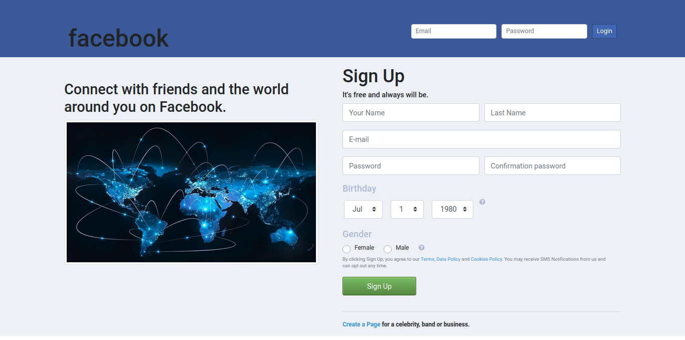
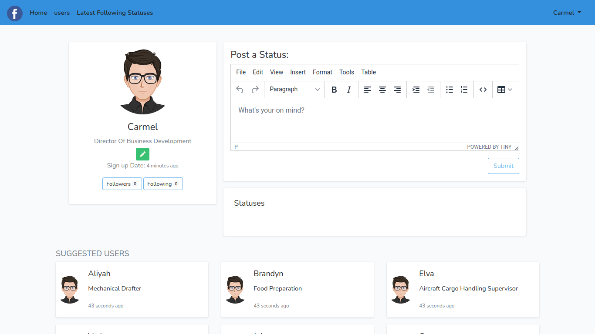
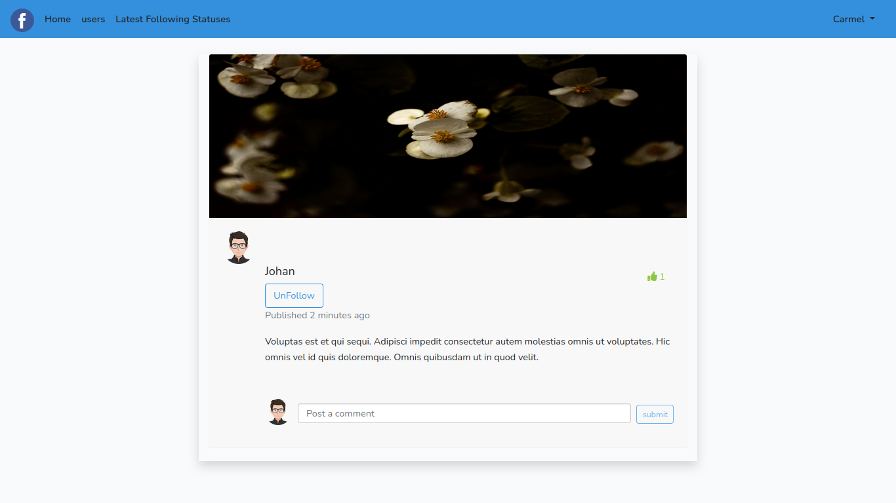
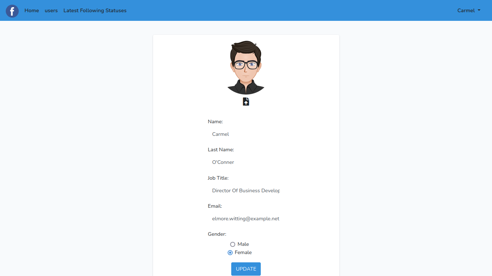

## **Preview Project**


#### **Login Page**


#### **Profile Page** 


#### **Post Page**


#### **Edit Profile Page**


## **Project setup**


#### setup composer
```
composer install
```

### copy .env.example file to .env

#### generate application key
```
php artisan key:generate
```

#### create database and then migrate the tables
```
php artisan migrate
```

#### optional. run seeder
```
php artisan db:seed
```

#### also setup node 
```
npm install
```

#### then 
```
npm run dev
```


### **_application is ready! enjoy :)_**
